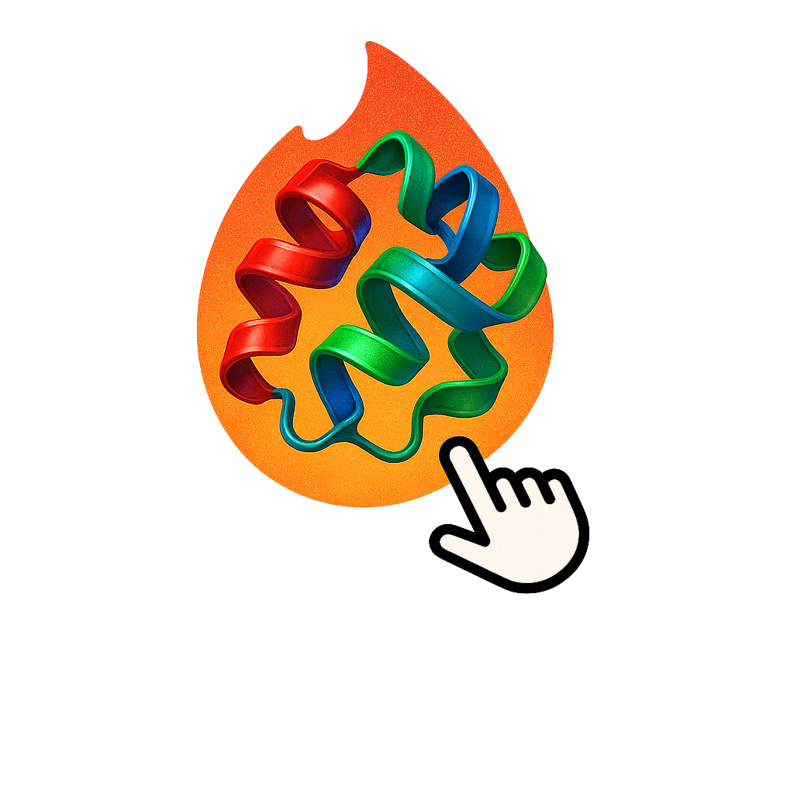

<div align="center">

# Protein Annotate App




A **mobile-friendly**, **web-based** platform for visualizing and annotating 3D protein structures using [3Dmol.js](https://3dmol.csb.pitt.edu/) and [NGL.js](https://www.npmjs.com/package/ngl). Built with Django, this app supports protein annotation through intuitive gestures and interactive tools.

</div>

---

## 🚀 Use Cases

### 1. **Swipe Annotations**  
Quickly classify protein models with swipe gestures:

- 👉 **Swipe right** — Mark as **Correct**  
- 👈 **Swipe left** — Mark as **Wrong**  
- 👇 **Swipe down** — Mark as **Unsure**

Annotations are saved to a MySQL database and can be exported as CSV from the web interface.

---

### 2. **Domain Annotation**  
Interactively annotate protein domains directly in the browser:

- 🎯 Drag across the domain bar to define regions  
- 🏷️ Name domains using the text field below  
- 🖱️ Adjust domain boundaries by dragging

💾 Export zip:
- **CSV**: One file per protein (see format below)
- **FASTA**: Each domain as a separate sequence entry
- **PDB**: Each domain as a separate PDB file


**Example `.csv` format**:
```csv
Domain Number,Start Residue,End Residue,Predicted Domain
1,1,181,XD2
2,182,294,XD3
```

### 3. **Domain Correction**  
Refine previously annotated domains by uploading `.pdb` and `.csv` files together:

- ✅ Mark incorrect domain entries  
- 📦 Upload `.zip` archives containing both `.pdb` and `.csv` files  
- ☑️ Enable **"Include architecture data?"** during upload

📁 Each `.csv` must match its `.pdb` filename (e.g., `protein_id.pdb` and `protein_id.csv`).

---

## 🧪 How to Use

1. 📝 Create an account  
2. 📤 Upload a `.zip` containing your `.pdb` files  
3. ✏️ Add an annotation title and description  
4. ⚙️ Annotate proteins using swipe or domain modes  
5. 📥 Export your annotations as `.csv` or `.fasta`

> 📌 Note: The filename of each `.pdb` serves as its `protein_id`.

---

## ✨ Features

- 🧬 Interactive 3D protein viewer  
- 📱 Mobile touch and desktop mouse support  
- 📊 Overview dashboard for grouped annotations  
- 🔐 User login and registration  
- 👥 User to user interaction
- 💾 Annotation export (CSV/FASTA/PDB)

---

## 🛠️ Tech Stack

- **Backend**: Python, Django  
- **Database**: MySQL  
- **Frontend**: HTML, JavaScript, 3Dmol.js, NGL.js  
- **Deployment**: Docker

---

## 🛠️ To Do

- If you have any suggestions please let me know!
- More robust nginx deployment
- Expanding domain correction with the ability to easily modify borders, names, etc.

---

## ⚙️ Run Locally

```bash
git clone https://github.com/victornemeth/ProteinTinder.git
cd ProteinTinder
docker compose up -d --build
```

Connect via localhost:8000

